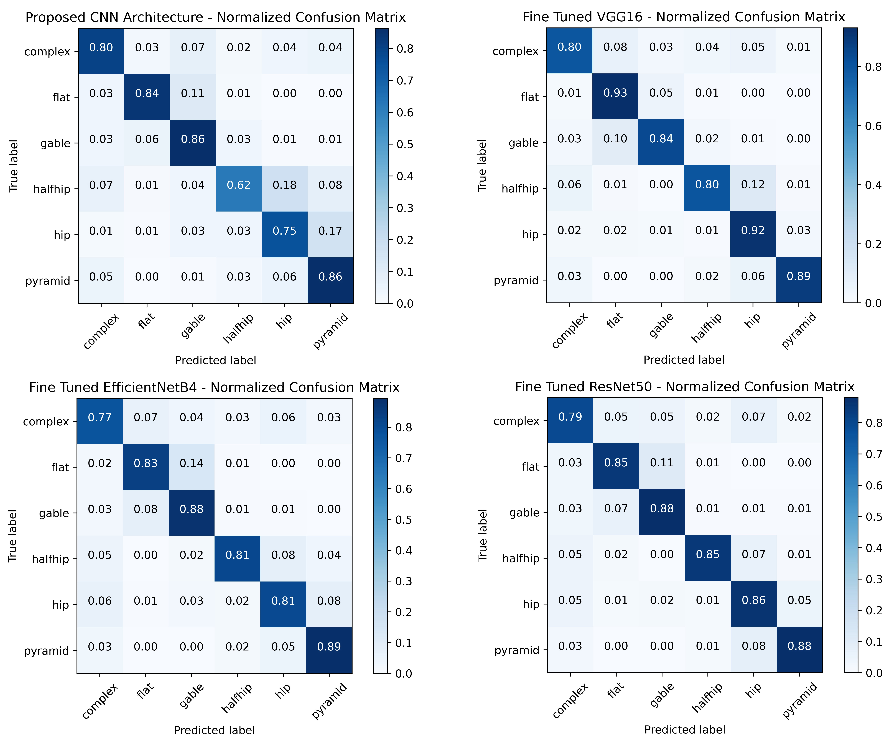

# Building Roof Type Classification

Deep Learning based roof type classification using very high resolution aerial imagery. This repository contains the implementation and improvements for the paper accepted to ISPRS 2021 Congress.

**Paper**: [Deep Learning based roof type classification using very high resolution aerial imagery](https://doi.org/10.5194/isprs-archives-XLIII-B3-2021-55-2021)

## Results 



## Features

### 🏗️ **Enhanced Training Pipeline** (`train.py`)
- **Fine-tuned VGG16** with two-phase training (frozen base → fine-tuning)
- **Smart Model Management**: Skip existing, continue training, or force retrain
- **Multiple Save Formats**: .keras, .h5, SavedModel, weights, and training history
- **Configurable Learning Rates** for each training phase
- **Resume Training**: Continue from existing models for additional epochs

### 🔍 **Two Inference Approaches**

#### 1. **Single Roof Classification** (`inference.py`)
- **Use Case**: Individual roof images (one roof per image)
- **Input**: Directory of pre-cropped roof images
- **Output**: One prediction per image file
- **Best For**: Validation sets, pre-segmented roof datasets

#### 2. **Multi-Roof Orthophoto Analysis** (`orthophoto_inference.py`)
- **Use Case**: Large orthophotos/aerial images with multiple roofs
- **Input**: Aerial/satellite imagery containing multiple buildings
- **Output**: Multiple detections with coordinates and classifications
- **Features**: 
  - Sliding window detection with NMS and confidence filtering
  - **Multi-channel support**: RGB, RGBA, RGBI, multi-spectral images
  - **Shapefile export**: GIS-compatible polygon data with attributes
  - **Mask generation**: Class and confidence raster masks
  - **Visualization**: Annotated images with bounding boxes
  - **Geographic coordinates**: Support for georeferenced imagery
- **Best For**: Urban planning, roof surveys, aerial imagery analysis, GIS workflows

## Quick Start

### Installation

```bash
# Clone repository
git clone <repository-url>
cd building_rooftype_classification

# Install dependencies
pip install -r requirements.txt
```

### Training

```bash
# Basic training (auto-detects existing models)
python train.py

# Force retrain from scratch
python train.py --force_retrain

# Continue training for more epochs
python train.py --continue_training --additional_epochs 10
```

### Inference

#### For Individual Roof Images:
```bash
# Basic inference
python inference.py --input_dir output/val/gable/

# With visualization and CSV output
python inference.py --input_dir output/val/ --visualize --output_csv results.csv
```

#### For Orthophotos with Multiple Roofs:
```bash
# Basic orthophoto analysis
python orthophoto_inference.py --input_dir test_orthophotos/

# Advanced parameters with shapefile output
python orthophoto_inference.py \
    --input_dir test_orthophotos/ \
    --window_sizes 200,300,400 \
    --confidence_threshold 0.8 \
    --output_shapefile detections.shp \
    --coordinate_system geographic \
    --visualize

# Complete output with masks and all formats
python orthophoto_inference.py \
    --input_dir test_orthophotos/ \
    --output_csv detections.csv \
    --output_shapefile detections.shp \
    --create_masks \
    --visualize \
    --confidence_threshold 0.7
```

### Compare Approaches
```bash
# See detailed comparison and examples
python compare_inference_approaches.py
```

## Roof Types Classified

The model classifies roofs into 7 categories:
- **Complex**: Multi-faceted, irregular roofs
- **Flat**: Horizontal, low-slope roofs  
- **Gable**: Traditional triangular roofs
- **Halfhip**: Combination of gable and hip features
- **Hip**: Four-sided sloped roofs
- **L-shaped**: L-configured roof structures
- **Pyramid**: Four triangular faces meeting at apex

## Key Configuration Options

### Training Parameters (`train.py`)
```python
IMG_HEIGHT = 140
IMG_WIDTH = 140
BATCH_SIZE = 32
INITIAL_EPOCHS = 10        # Phase 1: Frozen base
FINE_TUNE_EPOCHS = 20      # Phase 2: Fine-tuning
INITIAL_LEARNING_RATE = 0.001   # Phase 1 rate
FINE_TUNE_LEARNING_RATE = 0.0001 # Phase 2 rate
```

### Orthophoto Inference Parameters
- **Multi-channel Support**: RGB, RGBA, RGBI, multi-spectral (uses first 3 channels)
- `--window_sizes`: Sliding window sizes (e.g., "200,300,400")
- `--stride_ratio`: Window overlap (0.5 = 50% overlap)
- `--confidence_threshold`: Minimum prediction confidence (0.6)
- `--nms_threshold`: Non-maximum suppression threshold (0.3)
- `--output_shapefile`: Export detections as GIS shapefile
- `--coordinate_system`: Use 'pixel' or 'geographic' coordinates
- `--create_masks`: Generate class and confidence raster masks

## File Structure

```
building_rooftype_classification/
├── train.py                    # Enhanced training script
├── inference.py               # Single roof inference
├── orthophoto_inference.py    # Multi-roof orthophoto analysis
├── compare_inference_approaches.py  # Usage comparison guide
├── requirements.txt           # Python dependencies
├── README.md                 # This file
├── TRAINING_README.md        # Detailed training guide
├── output/                   # Training data
│   ├── train/               # Training images by class
│   └── val/                # Validation images by class
├── test_orthophotos/        # Large aerial images for testing
└── models/                  # Saved model files
    ├── fine_tuned_vgg16_final.keras
    ├── fine_tuned_vgg16_final.h5
    └── fine_tuned_vgg16_final_savedmodel/
```

## Advanced Usage

### Custom Model Training
```bash
# Train with custom parameters
python train.py \
    --initial_epochs 15 \
    --fine_tune_epochs 25 \
    --batch_size 16 \
    --initial_lr 0.0005
```

### Batch Processing with Confidence Filtering
```bash
# Process multiple orthophotos with high confidence only
python orthophoto_inference.py \
    --input_dir aerial_survey/ \
    --confidence_threshold 0.85 \
    --nms_threshold 0.2 \
    --output_dir survey_results/ \
    --visualize
```

### Validation and Testing
```bash
# Test on validation set
python inference.py \
    --input_dir output/val/ \
    --output_csv validation_results.csv \
    --confidence_threshold 0.5

# Generate confusion matrix
python -c "from train import *; generate_confusion_matrix()"
```

## Output Examples

### Single Roof Inference Output:
```
Image: gable_001.png → Prediction: gable (confidence: 0.94)
Image: hip_002.png → Prediction: hip (confidence: 0.87)
...
```

### Orthophoto Inference Output:
```
Processing: neighborhood_aerial.png
  Image size: 2000x1500
  Image mode: RGBA
  Converted RGBA to RGB (removed alpha channel)
  Final image shape for processing: (1500, 2000, 3)
  Extracted 1200 windows
  Raw detections: 156
  Above confidence threshold (0.6): 89
  After NMS (threshold 0.3): 23

Files generated:
  📊 CSV: detections.csv (tabular data)
  🗺️  Shapefile: detections.shp (GIS polygons)
  🗺️  GeoJSON: detections.geojson (web-compatible)
  🎭 Class masks: *_class_mask.png (raster masks)
  🎭 Confidence masks: *_confidence_mask.png
  📈 Visualizations: *_detections.png
  📋 Class legend: class_legend.txt

Detections with coordinates and attributes:
  X:450, Y:200, Class:gable, Confidence:0.91
  X:800, Y:300, Class:hip, Confidence:0.86
  ...
```

## Performance Notes

- **Single Roof Inference**: Fast, direct classification
- **Orthophoto Inference**: Slower due to sliding window approach
- **Memory Usage**: Orthophoto processing uses more memory for large images
- **Accuracy**: Single roof inference typically more accurate on individual roofs

## Citation

If you use this code in your research, please cite:

```bibtex
@article{roof_classification_2021,
  title={Deep Learning based roof type classification using very high resolution aerial imagery},
  author={[Authors]},
  journal={ISPRS Archives},
  year={2021},
  url={https://doi.org/10.5194/isprs-archives-XLIII-B3-2021-55-2021}
}
```

## License

[Add your license information here]
